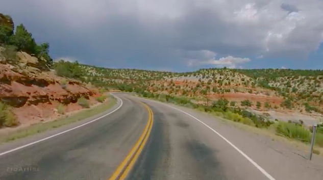
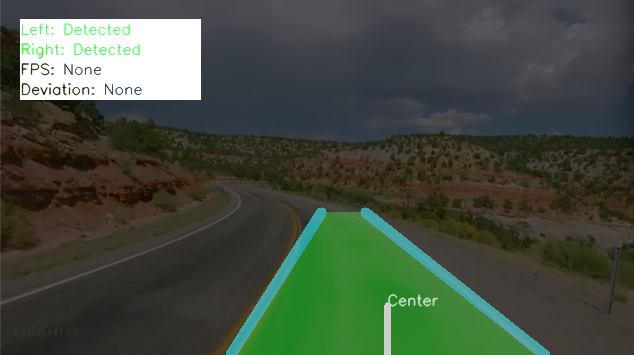
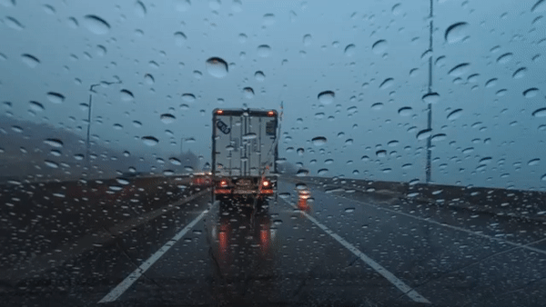
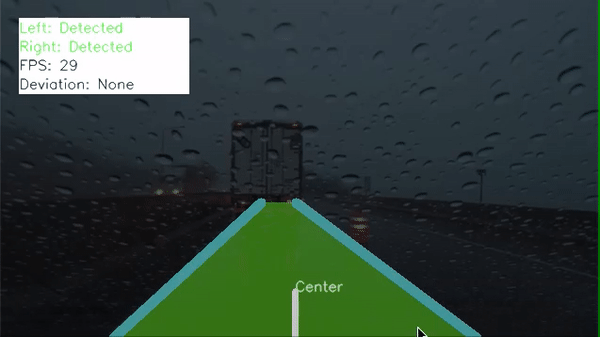

# Detecting Lanes :motorway:
Written in Python, this will detect lanes on roads. If both left and right lanes are detected, the road will be covered in green. This version only detects straight lanes. Future versions will have the ability to detect curves.

 
 
 


## Prerequisites
You need to install the following
 - OpenCV
 - Anaconda

## Installation
```bash
git clone ***
```

## Usage
After cloning the repository, change the "main(**your file name**)" at the bottom of _main.py_.

## Versioning
For the versions available, see the tags on this repository.

## Authors
Tergel Molom-Ochir - Initial work

## License
[MIT](https://choosealicense.com/licenses/mit/)

